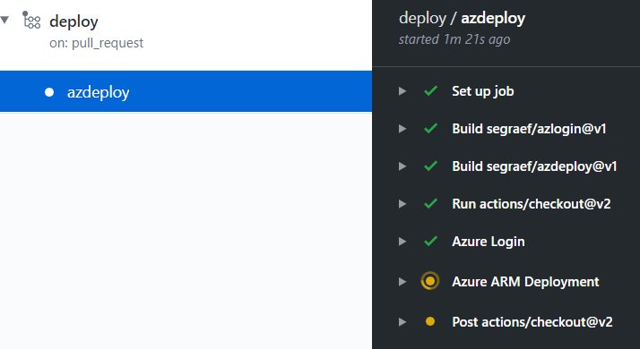
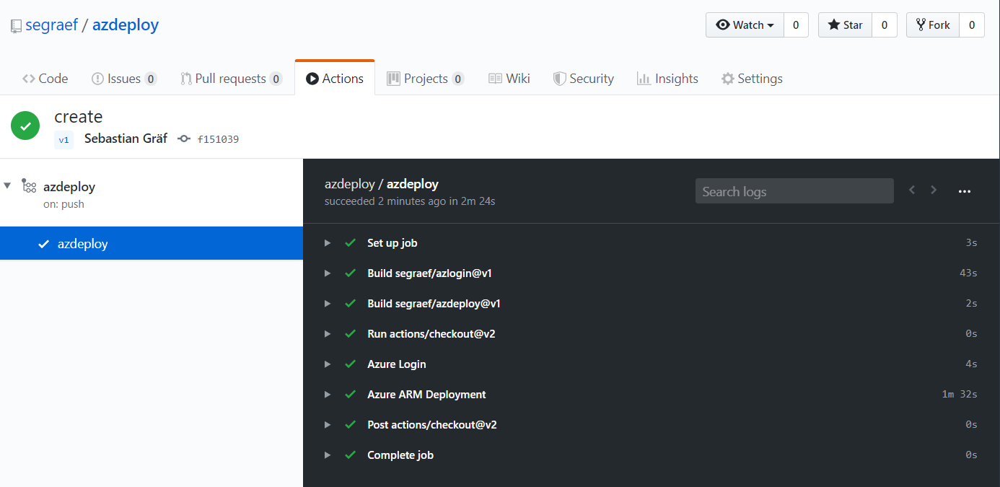
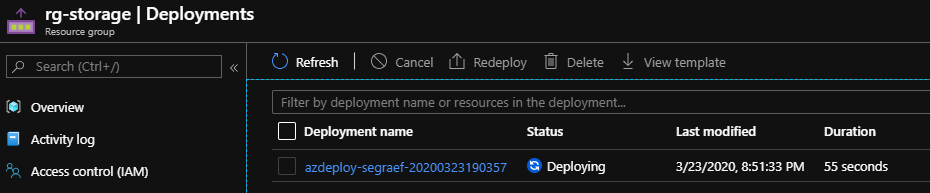

# Azure GitHub Actions and Workflows

With the GitHub Actions [azlogin](https://github.com/segraef/azlogin) and [azdeploy](https://github.com/segraef/azdeploy) you will be able to deploy resources in Azure.

# Quickstart

1. Clone [this](https://github.com/segraef/aga.git) repository.
2. Create following secrets in your repository
- `clientId` – **Required**
- `clientSecret` – **Required**
- `tenantId` – **Required**
- `subscriptionId` – **Required**
3. Change the parameters in your [`parameters.json`](./Modules/StorageAccount/parameters.json).
4. You might change following variables in your GitHub workflow `deploy.yml`

    `resourceGroupName: "rg-storage"`  
    `resourceGroupLocation: "westeurope"`
5. Commit your changes and your GitHub Workflow will start to run.

    

> **Note** 
> You can create get the above details by running following command in your Azure environment ([details](https://docs.microsoft.com/en-us/cli/azure/ad/sp?view=azure-cli-latest#az-ad-sp-create-for-rbac))

`az ad sp create-for-rbac --name "<spName>" --role contributor --scopes /subscriptions/<subscriptionId> --sdk-auth`

# References

[segraef/azlogin](https://github.com/segraef/azlogin)

[segraef/azdeploy](https://github.com/segraef/azdeploy)